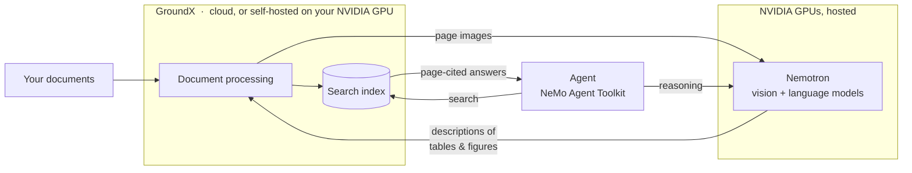

# GroundX + NVIDIA Quickstart

An AI agent that answers questions about complex documents and cites the exact page — GroundX reads and searches the documents, NVIDIA Nemotron does the reasoning, and NVIDIA's NeMo Agent Toolkit runs the agent.

**Why GroundX for the document layer:**

- **Accuracy where documents are hard.** A vision model reads every page the way a person does — tables, figures, layout — before any language model touches it. Up to 99% accuracy on documents that break general-purpose pipelines; Air France/KLM measured 96.2% against a 60% target. ([Published head-to-head test](https://www.eyelevel.ai/post/most-accurate-rag), documents and code public.)
- **Cheaper at scale, by design.** Because pages are broken into typed elements first, small fast models do the enrichment work — no frontier-scale model required for ingestion.
- **Runs anywhere, configured two ways.** Same product as GroundX cloud or self-hosted on your GPUs (public [Helm chart](https://github.com/eyelevelai/groundx-on-prem), air-gap capable). Deployment is configured with Helm values; *processing* is configured with **workflows** — per-bucket, at runtime, over the API. You'll use both below.

NVIDIA models and GPUs are in the path twice — **Nemotron reads every page during document processing** (that's what makes tables and figures searchable) and powers the agent's reasoning. Self-hosted GroundX adds a third: its page-reading vision model and search reranker run on **your** NVIDIA GPU.



## Contents

- [What you need](#what-you-need)
- [Scenario A — GroundX cloud](#scenario-a--groundx-cloud) *(fastest: ~10 minutes)*
- [Scenario B — self-hosted GroundX + NVIDIA models](#scenario-b--self-hosted-groundx--nvidia-models) *(your machine: ~45 minutes)*
- [Where your data goes](#where-your-data-goes)
- [Troubleshooting](#troubleshooting)

## What you need

- Python 3.11 or newer
- An NVIDIA API key — free at [build.nvidia.com](https://build.nvidia.com)
- A GroundX API key — free at [dashboard.groundx.ai](https://dashboard.groundx.ai)
- Scenario B additionally needs a GPU machine — see [deploy/](deploy/)

## Scenario A — GroundX cloud

Documents go to your GroundX cloud account; nothing to install beyond Python packages.

```bash
git clone https://github.com/EyeLevel-ai/groundx-nvidia-quickstart
cd groundx-nvidia-quickstart
cp .env.example .env          # put your two keys in .env
python -m venv .venv && .venv/bin/pip install -r requirements.txt
```

**1. Point document processing at NVIDIA models** — one command:

```bash
.venv/bin/python scripts/nvidia_workflow.py
```

This is GroundX's **workflow** system doing what it's for: every processing stage — document summaries, keywords, section and chunk summaries, search-query generation — is a configurable step, and any step can run on any OpenAI-compatible model, per bucket, changed at runtime with an API call. This command points all of them at NVIDIA's vision-capable Nemotron. The same mechanism swaps prompts, chunking strategy, and models per project without redeploying anything.

**2. Load a document** (the sample is the IRS Form 1040 instructions — 100+ pages of dense tables; processing takes a few minutes, now running on Nemotron):

```bash
.venv/bin/python scripts/ingest.py
```

**3. Ask the agent a question:**

```bash
scripts/run_agent.sh "What is the standard deduction for married filing jointly? Cite the page."
```

**4. Use your own documents:**

```bash
.venv/bin/python scripts/ingest.py https://example.com/your-document.pdf
```

Prefer a notebook? [`notebooks/quickstart.ipynb`](notebooks/quickstart.ipynb) walks the same steps plus a raw-REST example.

## Scenario B — self-hosted GroundX + NVIDIA models

GroundX runs on your own GPU machine; documents never leave it. Your NVIDIA GPU runs the page-reading vision model and the search reranker; NVIDIA's hosted Nemotron handles enrichment, receiving page images during processing.

1. Install on your machine (or let the AWS script create one): **[deploy/](deploy/)** — one required input, ~45 minutes. Here the NVIDIA model choice lives in Helm values (deployment configuration); workflows work on top of it exactly as in Scenario A.
2. Point the same scripts at your instance with one line in `.env`:
   ```
   GROUNDX_BASE_URL=http://your-machine:8080/api
   ```
3. Load documents and search exactly as in Scenario A.

Note: the agent demo (`run_agent.sh`) uses GroundX's cloud tool endpoint and works with Scenario A; document loading and search in Scenario B are driven through the scripts and notebook.

## Where your data goes

| Scenario | Your documents | The model |
|---|---|---|
| A — cloud | Your GroundX cloud account; delete anytime with `scripts/cleanup.py` | NVIDIA-hosted Nemotron receives page images during processing and text passages at question time — never files |
| B — self-hosted | Stay on your machine | Same: page images during processing, text passages at question time — never files |

API keys travel only in connection headers — never in prompts, tool arguments, or logs. Fully local deployments (models included, air-gap capable) are a production option in the [main deployment repo](https://github.com/eyelevelai/groundx-on-prem).

## Troubleshooting

| Symptom | Fix |
|---|---|
| `mcp_client not found` when validating the config | `pip install "nvidia-nat[mcp]"` (already in requirements.txt) |
| `401 Unauthorized` connecting to GroundX | The header block in `configs/groundx_agent.yml` must be `custom_headers`, and `GROUNDX_API_KEY` must be set in `.env` |
| Model error about context length after a search | Keep the `additional_instructions` block in the config — it tells the agent to request small search responses |
| `Session termination failed: 401` warning at exit | Harmless; appears after the tools have already succeeded |
| Agent searches the wrong bucket | Ask questions that name the bucket, or keep the account free of unrelated buckets |
