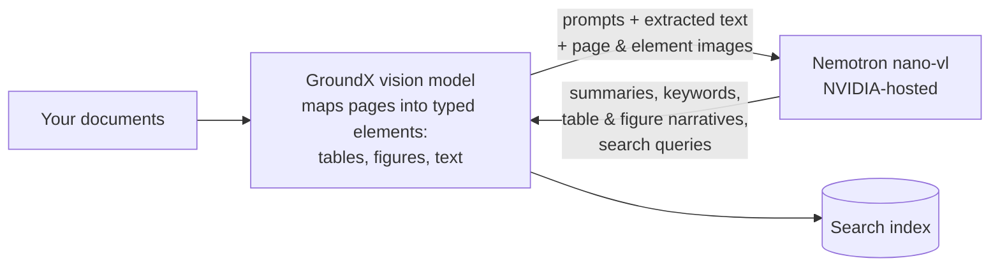
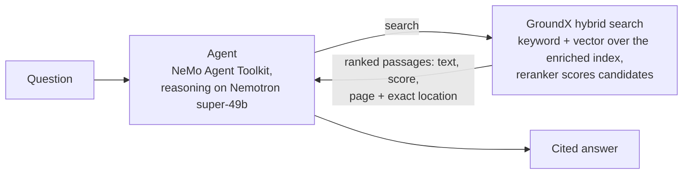

# GroundX + NVIDIA Quickstart

Answer questions about complex documents with citations to the exact page — GroundX reads and searches the documents, NVIDIA Nemotron powers the processing and the reasoning.

**GroundX is built to be driven by agents, and this quickstart shows both halves of that:**

- **Your coding agent operates GroundX** — configuring processing onto NVIDIA models, loading documents, searching, planning a deployment. That's the [GroundX Agent Harness](https://github.com/GroundX-Studio/groundx-agent-harness), and it's how you'll go through this quickstart.
- **An NVIDIA-toolkit agent uses GroundX** — a NeMo Agent Toolkit agent reasoning on Nemotron, retrieving through GroundX's MCP server, answering with page citations.

Everything in this repo — the workflow configuration, the single-node install, the deployment values, the thirteen undocumented install blockers it works around — was produced by an agent driving GroundX through those harness skills. The commit history is the receipt.

- [What you need](#what-you-need)
- [Give your agent GroundX fluency](#give-your-agent-groundx-fluency) *(~10 minutes to a cited answer)*
- [Prefer deterministic commands?](#prefer-deterministic-commands)
- [Run it on your own GPU](#run-it-on-your-own-gpu) *(~45 minutes)*
- [How it works](#how-it-works)
- [Where your data goes](#where-your-data-goes)
- [Go deeper](#go-deeper)
- [Troubleshooting](#troubleshooting)

## What you need

- An NVIDIA API key — free at [build.nvidia.com](https://build.nvidia.com)
- A GroundX API key — free at [dashboard.groundx.ai](https://dashboard.groundx.ai)
- A coding agent: Claude Code, Codex, or another the [harness](https://github.com/GroundX-Studio/groundx-agent-harness) supports — *or* Python 3.11+ if you'd rather run the [scripts](#prefer-deterministic-commands)
- The [own-GPU path](#run-it-on-your-own-gpu) additionally needs a GPU machine

## Give your agent GroundX fluency

The harness is a free skills bundle that teaches your agent how GroundX works — processing workflows, ingest, search, structured extraction, self-hosted deployment. You supply the NVIDIA endpoint and model; the agent knows what to do with them.

```bash
claude plugin marketplace add GroundX-Studio/groundx-agent-harness
claude plugin install groundx-agent-harness@groundx-agent-harness
```

Set both keys in the shell that starts your agent (setup for Codex and other clients is in the [harness repo](https://github.com/GroundX-Studio/groundx-agent-harness)):

```bash
export GROUNDX_API_KEY=...   NVIDIA_API_KEY=nvapi-...
```

Then work through these four asks. Each one has a checkable outcome — if your agent's answer doesn't match, it went wrong, not you:

| Ask your agent | What it does | How you know it worked |
|---|---|---|
| *"Point my GroundX document processing at NVIDIA's hosted Nemotron — use the vision-capable `nvidia/llama-3.1-nemotron-nano-vl-8b-v1` — for a bucket called `nvidia-quickstart-demo`."* | Creates a GroundX **workflow** that runs every processing stage on that model, and assigns it to the bucket | It reports a workflow id, and every stage it lists — document and section summaries, keywords, chunk summaries, table-and-figure instructions, search-query generation — points at `integrate.api.nvidia.com` |
| *"Load IRS Publication 501 (`https://www.irs.gov/pub/irs-pdf/p501.pdf`) into that bucket and tell me when processing finishes."* | Ingests the ~30-page document and polls until it's done | Status reaches `complete` after a few minutes, on Nemotron |
| *"What's the standard deduction for married filing jointly? Cite the page."* | Searches the bucket and answers from the results | An answer **with a page number** — and if you ask, the bounding box on that page |
| *"Show me what processing actually produced for one of the table chunks."* | Fetches the document's X-Ray | Per-element JSON: summaries, keywords, a plain-language narrative and structured data for the table, plus the page image URL |

Then keep going in your own words — *"add a custom prompt for financial tables"*, *"why is this document stuck?"*, *"load these 40 PDFs and tell me which ones failed"*. That is the point: the work above is configuration and orchestration, and an agent that knows the platform can do all of it.

**One credential caution:** with your GroundX key the agent can create *and delete* documents and buckets. Treat it like any credential, and use a separate account if you want a sandbox.

## Prefer deterministic commands?

Same four steps, as scripts — this is what the agent runs, and what you'd use in CI:

```bash
git clone https://github.com/EyeLevel-ai/groundx-nvidia-quickstart
cd groundx-nvidia-quickstart
cp .env.example .env          # your two keys
python -m venv .venv && .venv/bin/pip install -r requirements.txt

.venv/bin/python scripts/nvidia_workflow.py    # 1. processing onto Nemotron
.venv/bin/python scripts/ingest.py             # 2. load the sample document
scripts/run_agent.sh "What is the standard deduction for married filing jointly? Cite the page."
```

The third command is the **run-time** half: a NeMo Agent Toolkit agent, reasoning on Nemotron, retrieving through GroundX's hosted MCP server at `https://api.groundx.ai/mcp` — a standard tool interface any agent framework can use. Its entire configuration is [`configs/groundx_agent.yml`](configs/groundx_agent.yml), about forty lines, no glue code.

[`notebooks/quickstart.ipynb`](notebooks/quickstart.ipynb) walks the same steps cell by cell, plus a raw-REST example and a look inside the X-Ray.

## Run it on your own GPU

Documents stay on your machine. Your NVIDIA GPU runs GroundX's page-reading vision model and search reranker; NVIDIA's hosted Nemotron handles enrichment. This path covers loading and cited search — the run-time agent demo needs GroundX's hosted MCP server, which the single-node build doesn't include.

Run the scripts in **[deploy/](deploy/)**: one required input, ~45 minutes, on a GPU machine or a fresh AWS instance the script creates for you. Your agent is useful alongside them — *"what is this pod waiting on?"*, *"raise the vision-model workers and roll it"* — but the scripts lead here, because they encode thirteen fixes for undocumented single-node blockers that the harness skills don't cover yet. Publishing that pattern upstream is [an open proposal](https://github.com/eyelevelai/groundx-on-prem); until it lands, the scripts are the reliable path.

Either way, point the same tooling at the result: `GROUNDX_BASE_URL=http://localhost:8080/api` plus the `admin.apiKey` from [`deploy/values-single-node.yaml`](deploy/values-single-node.yaml). Local processing is slower than cloud — the ~30-page sample takes roughly 15–20 minutes at the [measured](docs/sizing-worksheet.md) ~110 pages/hour; it isn't hung.

## How it works

**Ingestion.** GroundX's own vision model maps every page into typed elements — tables, figures, text blocks. Then, for each element, section, and document, workflow steps call Nemotron with the step's prompt, the extracted text, and the page and element images. What comes back is much more than captions: summaries and keywords at every level, plain-language narratives and structured data for each table and figure, retrieval-optimized search queries, and multiple renderings of every chunk. All of it lands in the search index — and in a per-document JSON (the "X-Ray") you can download and inspect.



**Search.** GroundX search is hybrid: a weighted keyword-and-vector query runs across all that enrichment — summaries, keywords, chunk renderings — to pull a candidate set, and a fine-tuned reranker then scores each candidate against the query; the final ranking blends both signals. Each result returns the passage (original and LLM-tuned text), its relevance score, the file, and the exact page and rectangle it came from; table and figure results also carry their structured data and narratives.



**Why this design.**

- **Agent-operable, top to bottom.** Every stage of processing is a runtime-configurable step reachable over the API, per bucket, no redeploy — which is why an agent can set all of this up conversationally, and why standing up the hundredth use case looks like the first.
- **Tested in public.** A preregistered eval against NVIDIA's own RAG blueprint is underway in the [eval harness repo](https://github.com/EyeLevel-ai/groundx-doc-eval-harness): the corpus, questions, and [win bar](https://github.com/EyeLevel-ai/groundx-doc-eval-harness/blob/main/preregistration/decision-rule.md) are committed and checksummed before any system runs, and NVIDIA is invited to veto any of them beforehand. A prior published [head-to-head test](https://www.eyelevel.ai/post/most-accurate-rag) is also public.
- **Small models suffice.** Because pages become small typed elements first, compact fast models handle the enrichment — no frontier-scale model needed at ingest.
- **Runs anywhere.** The same product runs as cloud or self-hosted ([public Helm chart](https://github.com/eyelevelai/groundx-on-prem), air-gap capable), configured by Helm values at deployment and by workflows at runtime.

## Where your data goes

| | GroundX cloud | Your own GPU |
|---|---|---|
| Your document files | Stored in your GroundX cloud account | Stay on your machine |
| Processing artifacts (page/element images, extracted text, search index, X-Ray) | Your GroundX cloud account | Your machine |
| What Nemotron receives during processing | The workflow steps' prompts, extracted text, and page/element images | Same — sent base64 inside the requests |
| What the agent's model receives at question time | Your question and the retrieved passages | Same |
| Deleting | `scripts/cleanup.py`, or any API/dashboard delete | Your storage, your policies |

Raw document files never go to NVIDIA either way. API keys travel only in connection headers — never in prompts, tool arguments, or logs. Fully local deployments (every model included, air-gap capable) are a production option in the [main deployment repo](https://github.com/eyelevelai/groundx-on-prem).

## Go deeper

- [Security fact sheet](docs/it-reviewer-fact-sheet.md) — what runs where and what leaves the firewall, per configuration
- [GPU sizing](docs/sizing-worksheet.md) — measured throughput and how document volume converts to GPU count
- [Running GroundX on NVIDIA models](docs/nemotron-engine.md) — the two configuration surfaces and endpoint findings
- [Preregistered eval vs NVIDIA's RAG blueprint](https://github.com/EyeLevel-ai/groundx-doc-eval-harness) — a four-system head-to-head with the rules checksummed before any system runs
- [AI-Q knowledge backend](aiq/) — *experimental preview:* GroundX as a retrieval backend for NVIDIA's AI-Q research agent, written to its published plug-in contract. Installing it means hand-editing an AI-Q checkout; not yet run inside an AI-Q workflow.

## Troubleshooting

| Symptom | Fix |
|---|---|
| Your agent doesn't seem to know GroundX | Confirm the plugin installed (`claude plugin list`) and that `GROUNDX_API_KEY` is set in the shell that started it |
| `mcp_client not found` when validating the agent config | Install from `requirements.txt` — it includes the MCP plugin |
| `401 Unauthorized` connecting to GroundX | The header block in `configs/groundx_agent.yml` must be `custom_headers`, and `GROUNDX_API_KEY` must be set in `.env` |
| Model error about context length after a search | Keep the `additional_instructions` block in the config — it tells the agent to request small search responses |
| Model returns empty/`null` content with `finish_reason: length` | You're on a reasoning model without the `/no_think` toggle or enough `max_tokens` — see [Gotcha 1](docs/nemotron-engine.md#gotcha-1--reasoning-models-return-null-content-by-default) |
| `Session termination failed: 401` warning at exit | Harmless; appears after the tools have already succeeded |
| Agent searches the wrong bucket | Name the bucket in your question; the scripted agent defaults to `nvidia-quickstart-demo` (pinned in [`configs/groundx_agent.yml`](configs/groundx_agent.yml)) |
