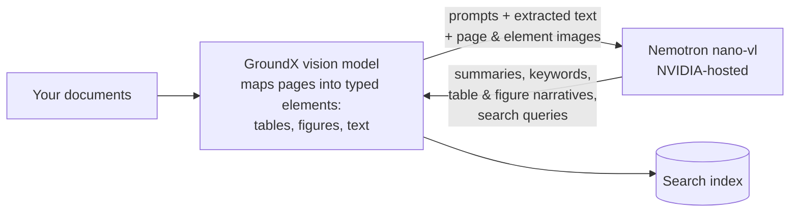
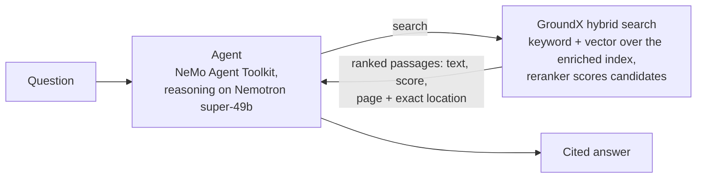

# GroundX + NVIDIA Quickstart

Build an AI agent that answers questions about complex documents and cites the exact page — GroundX reads and searches the documents, NVIDIA Nemotron powers the processing and the reasoning.

- [What you need](#what-you-need)
- [Scenario A — GroundX cloud](#scenario-a--groundx-cloud) *(~10 minutes)*
- [Scenario B — self-hosted GroundX + NVIDIA models](#scenario-b--self-hosted-groundx--nvidia-models) *(your GPU machine: ~45 minutes)*
- [How it works](#how-it-works)
- [Where your data goes](#where-your-data-goes)
- [Drive it from your coding agent](#drive-it-from-your-coding-agent)
- [Go deeper](#go-deeper)
- [Troubleshooting](#troubleshooting)

What each path demonstrates:

| | Load documents + cited search | Agent demo | Runs on your GPU | Every model local |
|---|---|---|---|---|
| **A — GroundX cloud** | ✓ | ✓ | — | — |
| **B — self-hosted** | ✓ | — | ✓ | — |
| [Production deployment](https://github.com/eyelevelai/groundx-on-prem) | ✓ | — | ✓ | ✓ |

The agent demo needs GroundX's hosted MCP tool server, so it runs on the cloud path; both other paths cover loading and cited search. Fully air-gapped operation (the language model local too) is the production deployment.

## What you need

- Python 3.11 or newer
- An NVIDIA API key — free at [build.nvidia.com](https://build.nvidia.com)
- A GroundX API key — free at [dashboard.groundx.ai](https://dashboard.groundx.ai)
- Scenario B additionally needs a GPU machine — see [deploy/](deploy/)

## Scenario A — GroundX cloud

Documents go to your GroundX cloud account; nothing to install beyond Python packages.

```bash
git clone https://github.com/EyeLevel-ai/groundx-nvidia-quickstart
cd groundx-nvidia-quickstart
cp .env.example .env          # put your two keys in .env
python -m venv .venv && .venv/bin/pip install -r requirements.txt
```

**1. Point document processing at NVIDIA models** — one command:

```bash
.venv/bin/python scripts/nvidia_workflow.py
```

GroundX **workflows** make every processing stage a runtime-configurable step; this command points them all at NVIDIA's vision-capable Nemotron. The mechanism — and two endpoint gotchas worth knowing — is in [docs/nemotron-engine.md](docs/nemotron-engine.md); [How it works](#how-it-works) below describes what the stages produce.

**2. Load a document** (the sample is IRS Publication 501 — ~30 pages of dense tables and worksheets; processing takes a few minutes, running on Nemotron):

```bash
.venv/bin/python scripts/ingest.py
```

**3. Ask the agent a question.** The agent discovers its GroundX tools (search, ingest) from GroundX's hosted MCP server at `https://api.groundx.ai/mcp` — a standard tool interface any agent framework can use; NVIDIA's toolkit connects to it natively:

```bash
scripts/run_agent.sh "What is the standard deduction for married filing jointly? Cite the page."
```

**4. Try something harder, or your own documents** (the 114-page IRS Form 1040 instructions are a good stress test):

```bash
.venv/bin/python scripts/ingest.py https://www.irs.gov/pub/irs-pdf/i1040gi.pdf
.venv/bin/python scripts/ingest.py https://example.com/your-document.pdf
```

Prefer a notebook? [`notebooks/quickstart.ipynb`](notebooks/quickstart.ipynb) walks the same steps, plus a raw-REST example and a look inside the per-document X-Ray JSON.

## Scenario B — self-hosted GroundX + NVIDIA models (loading and cited search)

The payoff: cited answers with page and bounding-box provenance, against documents that stay on your machine. Your NVIDIA GPU runs GroundX's page-reading vision model and search reranker; NVIDIA's hosted Nemotron handles enrichment.

1. Install on your machine, or let the AWS script create one: **[deploy/](deploy/)** — one required input, ~45 minutes. The NVIDIA model choice lives in Helm values here (deployment configuration); workflows work on top of it exactly as in Scenario A.
2. On that machine, clone this repo and install the Python packages, then point them at the local API with two lines in `.env`:
   ```bash
   git clone https://github.com/EyeLevel-ai/groundx-nvidia-quickstart && cd groundx-nvidia-quickstart
   python -m venv .venv && .venv/bin/pip install -r requirements.txt && cp .env.example .env
   ```

   Then set two lines in `.env` — the deploy guide's "Use it" section shows the port-forward that makes this address reachable, and the key is `admin.apiKey` from [`deploy/values-single-node.yaml`](deploy/values-single-node.yaml):

   ```
   GROUNDX_BASE_URL=http://localhost:8080/api
   GROUNDX_API_KEY=<admin.apiKey from deploy/values-single-node.yaml>
   ```
3. Load documents and search exactly as in Scenario A. Local processing is slower than cloud: expect the ~30-page sample to take roughly 15–20 minutes at the [measured](docs/sizing-worksheet.md) ~110 pages/hour — it isn't hung.

## How it works

**Ingestion.** GroundX's own vision model maps every page into typed elements — tables, figures, text blocks. Then, for each element, section, and document, workflow steps call Nemotron with the step's prompt, the extracted text, and the page and element images. What comes back is much more than captions: summaries and keywords at every level, plain-language narratives and structured data for each table and figure, retrieval-optimized search queries, and multiple renderings of every chunk. All of it lands in the search index — and in a per-document JSON (the "X-Ray") you can download and inspect; section 6 of [the notebook](notebooks/quickstart.ipynb) fetches and prints one.



**Search.** GroundX search is hybrid: a weighted keyword-and-vector query runs across all that enrichment — summaries, keywords, chunk renderings — to pull a candidate set, and a fine-tuned reranker then scores each candidate against the query; the final ranking blends both signals. Each result returns the passage (original and LLM-tuned text), its relevance score, the file, and the exact page and rectangle it came from; table and figure results also carry their structured data and narratives. The agent reasons over those results with Nemotron and writes the cited answer.



**Why this design.**

- **Tested in public.** A preregistered eval against NVIDIA's own RAG blueprint is underway in the [eval harness repo](https://github.com/EyeLevel-ai/groundx-doc-eval-harness): the corpus, questions, and [win bar](https://github.com/EyeLevel-ai/groundx-doc-eval-harness/blob/main/preregistration/decision-rule.md) are committed and checksummed before any system runs, and NVIDIA is invited to veto any of them beforehand. A prior published [head-to-head test](https://www.eyelevel.ai/post/most-accurate-rag) is also public.
- **Small models suffice.** Because pages become small typed elements first, compact fast models handle the enrichment — no frontier-scale model needed at ingest.
- **Runs anywhere.** The same product runs as cloud or self-hosted ([public Helm chart](https://github.com/eyelevelai/groundx-on-prem), air-gap capable), configured by Helm values at deployment and by workflows at runtime.

## Where your data goes

| | Scenario A — cloud | Scenario B — self-hosted |
|---|---|---|
| Your document files | Stored in your GroundX cloud account | Stay on your machine |
| Processing artifacts (page/element images, extracted text, search index, X-Ray) | Your GroundX cloud account | Your machine |
| What Nemotron receives during processing | The workflow steps' prompts, extracted text, and page/element images | Same — sent base64 inside the requests |
| What the agent's model receives at question time | Your question and the retrieved passages | Same |
| Deleting | `scripts/cleanup.py`, or any API/dashboard delete | Your storage, your policies |

Raw document files never go to NVIDIA in either scenario. API keys travel only in connection headers — never in prompts, tool arguments, or logs. Fully local deployments (every model included, air-gap capable) are a production option in the [main deployment repo](https://github.com/eyelevelai/groundx-on-prem).

## Go deeper

- [Security fact sheet](docs/it-reviewer-fact-sheet.md) — what runs where and what leaves the firewall, per configuration
- [GPU sizing](docs/sizing-worksheet.md) — measured throughput and how document volume converts to GPU count
- [Running GroundX on NVIDIA models](docs/nemotron-engine.md) — the two configuration surfaces and endpoint findings
- [Preregistered eval vs NVIDIA's RAG blueprint](https://github.com/EyeLevel-ai/groundx-doc-eval-harness) — a four-system head-to-head with the rules checksummed before any system runs
- [AI-Q knowledge backend](aiq/) — *experimental preview:* GroundX as a retrieval backend for NVIDIA's AI-Q research agent, written to its published plug-in contract. Installing it means hand-editing an AI-Q checkout; not yet run inside an AI-Q workflow.

## Drive it from your coding agent

Everything above can also be done conversationally. The [GroundX Agent Harness](https://github.com/GroundX-Studio/groundx-agent-harness) is a free skills bundle that makes Claude Code, Codex, and similar assistants fluent in GroundX — ingest and search, workflows, structured extraction, self-hosted deployment planning:

```bash
claude plugin marketplace add GroundX-Studio/groundx-agent-harness
claude plugin install groundx-agent-harness@groundx-agent-harness
```

Then ask in your own words — *"Why is my document stuck in processing?"* Set `GROUNDX_API_KEY` in the shell that starts your agent, and treat it like any credential — the agent can create and delete documents and buckets with it. Setup for other clients is in the [harness repo](https://github.com/GroundX-Studio/groundx-agent-harness).

## Troubleshooting

| Symptom | Fix |
|---|---|
| `mcp_client not found` when validating the config | Install from `requirements.txt` — it includes the MCP plugin |
| `401 Unauthorized` connecting to GroundX | The header block in `configs/groundx_agent.yml` must be `custom_headers`, and `GROUNDX_API_KEY` must be set in `.env` |
| Model error about context length after a search | Keep the `additional_instructions` block in the config — it tells the agent to request small search responses |
| Model returns empty/`null` content with `finish_reason: length` | You're on a reasoning model without the `/no_think` toggle or enough `max_tokens` — see [Gotcha 1](docs/nemotron-engine.md#gotcha-1--reasoning-models-return-null-content-by-default) |
| `Session termination failed: 401` warning at exit | Harmless; appears after the tools have already succeeded |
| Agent searches the wrong bucket | The agent defaults to the `nvidia-quickstart-demo` bucket (pinned in `additional_instructions`, [`configs/groundx_agent.yml`](configs/groundx_agent.yml)) — name another bucket in the question, or edit that line if you changed `GROUNDX_BUCKET` |
