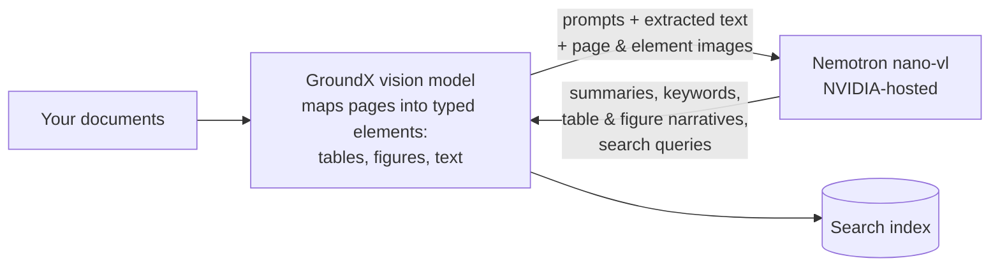
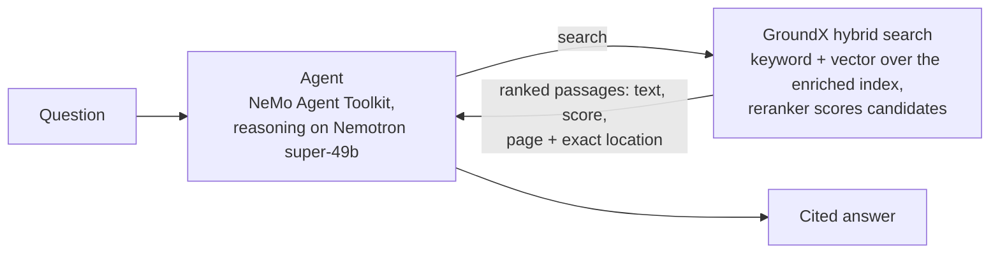

# GroundX + NVIDIA Quickstart

Build an AI agent that answers questions about complex documents and cites the exact page — GroundX reads and searches the documents, NVIDIA Nemotron powers the processing and the reasoning.

- [What you need](#what-you-need)
- [Scenario A — GroundX cloud](#scenario-a--groundx-cloud) *(~10 minutes)*
- [Scenario B — self-hosted GroundX + NVIDIA models](#scenario-b--self-hosted-groundx--nvidia-models) *(your GPU machine: ~45 minutes)*
- [Drive it from your coding agent](#drive-it-from-your-coding-agent)
- [How it works](#how-it-works)
- [Where your data goes](#where-your-data-goes)
- [Go deeper](#go-deeper) · [Troubleshooting](#troubleshooting)

## What you need

- Python 3.11 or newer
- An NVIDIA API key — free at [build.nvidia.com](https://build.nvidia.com)
- A GroundX API key — free at [dashboard.groundx.ai](https://dashboard.groundx.ai)
- Scenario B additionally needs a GPU machine — see [deploy/](deploy/)

## Scenario A — GroundX cloud

Documents go to your GroundX cloud account; nothing to install beyond Python packages.

```bash
git clone https://github.com/EyeLevel-ai/groundx-nvidia-quickstart
cd groundx-nvidia-quickstart
cp .env.example .env          # put your two keys in .env
python -m venv .venv && .venv/bin/pip install -r requirements.txt
```

**1. Point document processing at NVIDIA models** — one command:

```bash
.venv/bin/python scripts/nvidia_workflow.py
```

This uses GroundX **workflows**: every processing stage — document summaries, keywords, section and chunk summaries, the chunk instructions that turn tables and figures into searchable text, search-query generation — is a configurable step, and any step can run on any OpenAI-compatible model, per bucket (a named collection of documents), changed at runtime with an API call. This command points all of them at NVIDIA's vision-capable Nemotron. The same mechanism swaps prompts, chunking strategy, and models per project without redeploying anything.

**2. Load a document** (the sample is the IRS Form 1040 instructions — 100+ pages of dense tables; processing takes a few minutes, running on Nemotron):

```bash
.venv/bin/python scripts/ingest.py
```

**3. Ask the agent a question.** The agent discovers its GroundX tools (search, ingest) from GroundX's hosted MCP server at `https://api.groundx.ai/mcp` — a standard tool interface any agent framework can use; NVIDIA's toolkit connects to it natively:

```bash
scripts/run_agent.sh "What is the standard deduction for married filing jointly? Cite the page."
```

**4. Use your own documents:**

```bash
.venv/bin/python scripts/ingest.py https://example.com/your-document.pdf
```

Prefer a notebook? [`notebooks/quickstart.ipynb`](notebooks/quickstart.ipynb) walks the same steps plus a raw-REST example.

## Scenario B — self-hosted GroundX + NVIDIA models

GroundX runs on your own GPU machine; documents never leave it. Your NVIDIA GPU runs GroundX's page-reading vision model and search reranker; NVIDIA's hosted Nemotron handles enrichment.

1. Install on your machine, or let the AWS script create one: **[deploy/](deploy/)** — one required input, ~45 minutes. The NVIDIA model choice lives in Helm values here (deployment configuration); workflows work on top of it exactly as in Scenario A.
2. Run the quickstart scripts **on that machine**, pointing them at the local API with one line in `.env` (the deploy guide's "Use it" section shows the port-forward that makes this address work):
   ```
   GROUNDX_BASE_URL=http://localhost:8080/api
   ```
3. Load documents and search exactly as in Scenario A.

Note: the agent demo (`run_agent.sh`) connects to GroundX's hosted MCP tool server, which the single-node build doesn't include — so the agent step is for Scenario A; Scenario B drives loading and search through the scripts and notebook.

## Drive it from your coding agent

Everything above can also be done conversationally. The [GroundX Agent Harness](https://github.com/GroundX-Studio/groundx-agent-harness) is a free skills bundle that makes Claude Code, Codex, and similar assistants fluent in GroundX:

```bash
claude plugin marketplace add GroundX-Studio/groundx-agent-harness
claude plugin install groundx-agent-harness@groundx-agent-harness
```

(Those commands are for Claude Code; the [harness repo](https://github.com/GroundX-Studio/groundx-agent-harness) has steps for Codex and other clients.) What's in the bundle:

| Skill area | What your agent learns |
|---|---|
| Ingest & search | Load documents, check processing status, search with citations, debug stuck documents and empty results |
| Workflows & organization | Create and assign workflows (like this quickstart's), manage buckets and groups |
| Structured extraction | Build schema-first extraction workflows for pulling fields from documents |
| Self-hosted planning | Size and plan Helm-chart deployments |

Then ask in your own words: *"Create a workflow like nvidia-nemotron but add a custom chunk prompt for financial tables"* — *"Why is my document stuck in processing?"* — *"Plan a self-hosted GroundX install for a 3-node cluster."*

Set `GROUNDX_API_KEY` in the shell that starts your agent. With that key the agent can create and delete documents and buckets in your account — treat it like any credential, and use a separate account if you want a sandbox.

## How it works

**Ingestion.** GroundX's own vision model maps every page into typed elements — tables, figures, text blocks. Then, for each element, section, and document, workflow steps call Nemotron with the step's prompt, the extracted text, and the page and element images. What comes back is much more than captions: document and section summaries, keywords at every level, plain-language narratives and structured data for each table and figure, retrieval-optimized search queries, and multiple renderings of every chunk (original text, an LLM-tuned version, a search-tuned version). All of it lands in the search index — and in a per-document JSON (the "X-Ray") you can download and inspect.



**Search.** GroundX search is hybrid: a weighted keyword-and-vector query runs across all that enrichment — summaries, keywords, chunk renderings — to pull a candidate set, and a fine-tuned reranker then scores each candidate against the query; the final ranking blends both signals. Each result returns the passage (original and LLM-tuned text), its relevance score, the file, and the exact page and rectangle it came from; table and figure results also carry their structured data and narratives. The agent reasons over those results with Nemotron and writes the cited answer.



**Why this design.** The vision model reads layout the way a person does, which is why accuracy holds on documents that break text-only pipelines — up to 99% on hard documents; Air France/KLM measured 96.2% against a 60% target; EyeLevel's [head-to-head test](https://www.eyelevel.ai/post/most-accurate-rag) is public. Because pages become small typed elements first, compact fast models handle the enrichment — no frontier-scale model needed at ingest. And the same product runs as cloud or self-hosted ([public Helm chart](https://github.com/eyelevelai/groundx-on-prem), air-gap capable), configured by Helm values at deployment and by workflows at runtime.

## Where your data goes

| | Scenario A — cloud | Scenario B — self-hosted |
|---|---|---|
| Your document files | Stored in your GroundX cloud account | Stay on your machine |
| Processing artifacts (page/element images, extracted text, search index, X-Ray) | Your GroundX cloud account | Your machine |
| What Nemotron receives during processing | The workflow steps' prompts, extracted text, and page/element images | Same — sent base64 inside the requests |
| What the agent's model receives at question time | Your question and the retrieved passages | Same |
| Deleting | `scripts/cleanup.py`, or any API/dashboard delete | Your storage, your policies |

Raw document files never go to NVIDIA in either scenario. API keys travel only in connection headers — never in prompts, tool arguments, or logs. Fully local deployments (every model included, air-gap capable) are a production option in the [main deployment repo](https://github.com/eyelevelai/groundx-on-prem).

## Go deeper

- [Security fact sheet](docs/it-reviewer-fact-sheet.md) — what runs where and what leaves the firewall, per configuration
- [GPU sizing](docs/sizing-worksheet.md) — measured throughput and how document volume converts to GPU count
- [Running GroundX on NVIDIA models](docs/nemotron-engine.md) — the two configuration surfaces and endpoint findings
- [AI-Q knowledge backend](aiq/) — GroundX as a retrieval backend for NVIDIA's AI-Q research agent, written to its documented plug-in contract

## Troubleshooting

| Symptom | Fix |
|---|---|
| `mcp_client not found` when validating the config | Install from `requirements.txt` — it includes the MCP plugin |
| `401 Unauthorized` connecting to GroundX | The header block in `configs/groundx_agent.yml` must be `custom_headers`, and `GROUNDX_API_KEY` must be set in `.env` |
| Model error about context length after a search | Keep the `additional_instructions` block in the config — it tells the agent to request small search responses |
| `Session termination failed: 401` warning at exit | Harmless; appears after the tools have already succeeded |
| Agent searches the wrong bucket | Ask questions that name the bucket, or keep the account free of unrelated buckets |
