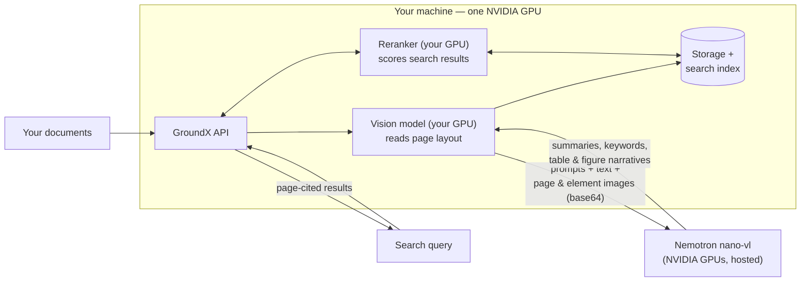

# GroundX on One GPU Machine, with NVIDIA's Hosted Nemotron

GroundX runs inside your own machine; NVIDIA's hosted Nemotron handles document enrichment. Documents never leave your machine — only page images and text passages go to the model. (Running every model locally is a production option in the [main deployment repo](https://github.com/eyelevelai/groundx-on-prem), not here.)

> **This build covers ingest and search — no agent demo.** The quickstart's agent demo needs GroundX's hosted MCP tool server, which the single-node build doesn't include. Everything else in the quickstart (scripts and notebook sections 1–6) works against it.



**The two scripts:**
- `single-node-install.sh` installs everything onto a GPU machine you already have: a single-node Kubernetes cluster, GroundX's services, the databases and search index they use, and the GPU sharing config — then connects GroundX to NVIDIA's hosted Nemotron.
- `provision-and-install-aws.sh` first creates that machine on AWS (GPU instance, correct image, disk), then runs the installer on it. Start here if you have nothing but an AWS account.

## Required

- Either path: `export NVIDIA_API_KEY=nvapi-...` — free at [build.nvidia.com](https://build.nvidia.com)
- AWS script only, additionally: `SUBNET_ID`, `SECURITY_GROUP_ID`, a logged-in AWS CLI, and an instance profile with Systems Manager access (its header lists them too)
- No GroundX license needed first: the placeholder `licenseKey` and `admin.apiKey` in `values-single-node.yaml` work as-is for this demo profile — `admin.apiKey` is the API key you'll use verbatim in "Use it" below

## Optional

- Demo passwords (admin login, database, object storage) — listed in the header of `values-single-node.yaml`. Fine to leave for a demo; change them for anything else.

## Run it

> **Warning:** `single-node-install.sh` runs `minikube delete` first — it destroys any existing minikube cluster on the machine. Use a fresh or dedicated machine.

Already have a GPU machine (Ubuntu 22.04, one NVIDIA GPU, 8 cores, 64GB RAM, 500GB disk, Docker + NVIDIA Container Toolkit — an AWS g6e.2xlarge with the Deep Learning Base GPU AMI matches):

```bash
export NVIDIA_API_KEY=nvapi-...
./single-node-install.sh
```

Starting from nothing on AWS (creates the machine, then installs on it):

```bash
export NVIDIA_API_KEY=nvapi-... SUBNET_ID=subnet-... SECURITY_GROUP_ID=sg-...
./provision-and-install-aws.sh
```

30–45 minutes either way, mostly downloads. Done when every pod in the `eyelevel` namespace shows `Running`.

## What runs on which GPU

Your GPU runs two models: the **vision model** that reads each page's layout during processing, and the **reranker** that scores results on every search. NVIDIA's hosted GPUs run **Nemotron**, which receives each processing step's prompt, extracted text, and page/element images, and returns the summaries, keywords, and table/figure narratives that make documents searchable. Everything else on the machine is CPU plumbing and storage.

One detail worth knowing: page images travel *inside* the requests to Nemotron (base64), because this machine's storage isn't reachable from the internet — that's the `service: openai-base64` line in the values file, and why the model there must be vision-capable.

Tested on a 48GB L40S with room to spare; should fit a 24GB GPU (not yet verified).

## Changing the NVIDIA model

Two surfaces, by design:

- **Deployment default** — the `engines` block in [`values-single-node.yaml`](values-single-node.yaml) (endpoint + model name; keep it vision-capable). Edit and re-run the `helm upgrade` line from the install script. Your API key is injected at install time and never sits in a file.
- **Per bucket, at runtime** — GroundX **workflows** override the deployment default for any bucket with an API call, no redeploy: see [`scripts/nvidia_workflow.py`](../scripts/nvidia_workflow.py). Same mechanism swaps prompts and chunking per project.

## Use it

The API runs inside the cluster; expose it on the machine, then talk to it like any GroundX instance:

```bash
kubectl -n eyelevel port-forward svc/groundx 8080:80 &
```

Your API key is the `admin.apiKey` value from `values-single-node.yaml`. Verify with a health check:

```bash
curl -H "X-API-Key: <admin.apiKey>" http://localhost:8080/api/v1/health
```

Then point the quickstart scripts at it: in `.env`, set `GROUNDX_BASE_URL=http://localhost:8080/api` and `GROUNDX_API_KEY=<admin.apiKey>`. Run the scripts on this machine; to drive them from elsewhere, add `--address 0.0.0.0` to the port-forward and firewall the port accordingly.

## Measured (July 2026, one 48GB L40S)

- Document processing: a 114-page IRS instruction booklet fully processed in 62 minutes (~110 pages/hour)
- Search: ~3 seconds per query

Measurement details, caveats, and projections for this profile: [sizing worksheet](../docs/sizing-worksheet.md).
