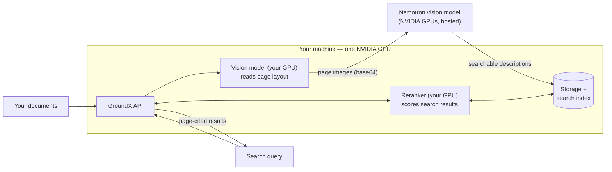

# GroundX on One GPU Machine, with NVIDIA's Hosted Nemotron

GroundX runs inside your own machine; NVIDIA's hosted Nemotron handles document enrichment. Documents never leave your machine — only page images and text passages go to the model. (Running every model locally is a production option in the [main deployment repo](https://github.com/eyelevelai/groundx-on-prem), not here.)



**The two scripts:**
- `single-node-install.sh` installs everything onto a GPU machine you already have: a single-node Kubernetes cluster, GroundX's services, the databases and search index they use, and the GPU sharing config — then connects GroundX to NVIDIA's hosted Nemotron.
- `provision-and-install-aws.sh` first creates that machine on AWS (GPU instance, correct image, disk), then runs the installer on it. Start here if you have nothing but an AWS account.

## Required

- `export NVIDIA_API_KEY=nvapi-...` — free at [build.nvidia.com](https://build.nvidia.com). **That's the only required input.**

## Optional

- Demo passwords (admin login, database, object storage) — listed in the header of `values-single-node.yaml`. Fine to leave for a demo; change them for anything else.

## Run it

Already have a GPU machine (Ubuntu 22.04, one NVIDIA GPU, 8 cores, 64GB RAM, 500GB disk, Docker + NVIDIA Container Toolkit — an AWS g6e.2xlarge with the Deep Learning Base GPU AMI matches):

```bash
export NVIDIA_API_KEY=nvapi-...
./single-node-install.sh
```

Starting from nothing on AWS (creates the machine, then installs on it):

```bash
export NVIDIA_API_KEY=nvapi-... SUBNET_ID=subnet-... SECURITY_GROUP_ID=sg-...
./provision-and-install-aws.sh
```

30–45 minutes either way, mostly downloads. Done when every pod in the `eyelevel` namespace shows `Running`.

## GPU use, in one breath

Your GPU runs two models: the **vision model** that reads each page's layout during processing, and the **reranker** that scores results on every search. NVIDIA's hosted GPUs run **Nemotron**, which looks at each page image and writes the descriptions that make tables and figures searchable. Everything else on the machine is CPU plumbing and storage.

One detail worth knowing: page images travel *inside* the requests to Nemotron (base64), because this machine's storage isn't reachable from the internet — that's the `service: openai-base64` line in the values file, and why the model there must be vision-capable.

Tested on a 48GB L40S with room to spare; should fit a 24GB GPU (not yet verified).

## Changing the NVIDIA model

Edit the `engines` block in [`values-single-node.yaml`](values-single-node.yaml) (endpoint + model name — keep it vision-capable), then re-run the `helm upgrade` line from the install script. Your API key is injected at install time and never sits in a file.

## Measured (July 2026, one 48GB L40S)

- Document processing: a 114-page IRS instruction booklet fully processed in about an hour (~110 pages/hour) — measured on an earlier profile that also ran a local language model; this profile frees that model's ~19GB of GPU memory and doubles the vision-model workers, so expect better (not yet re-measured)
- Search: ~3 seconds per query
